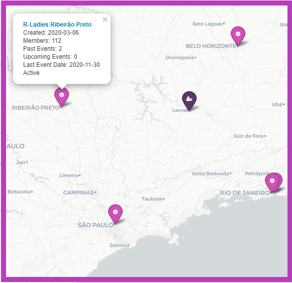
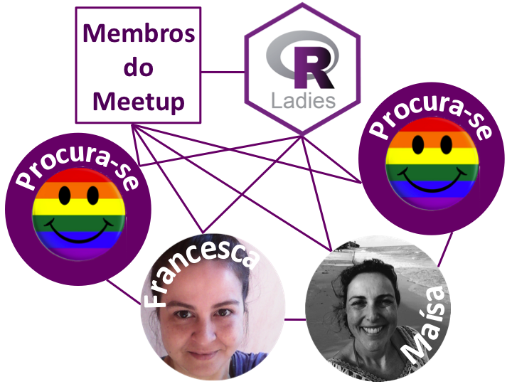
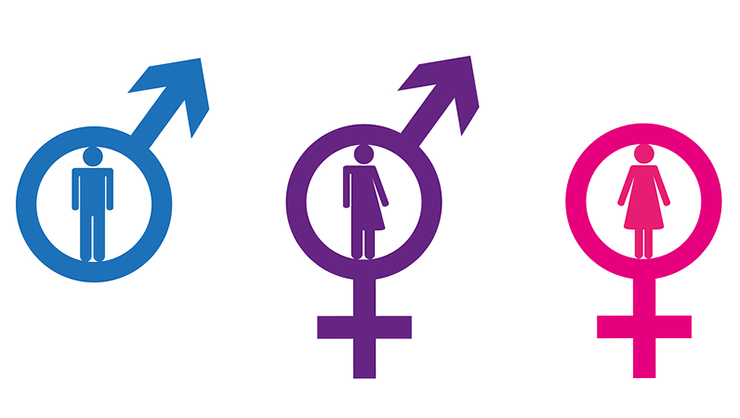
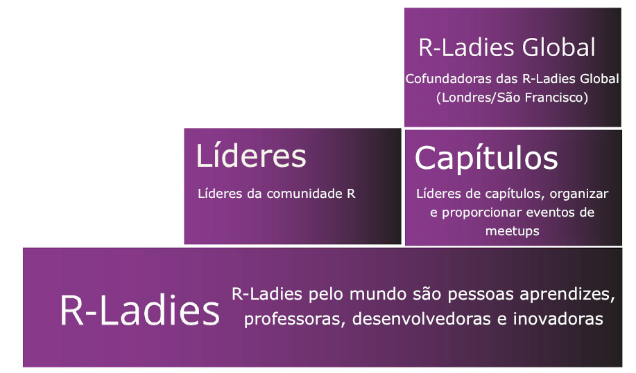
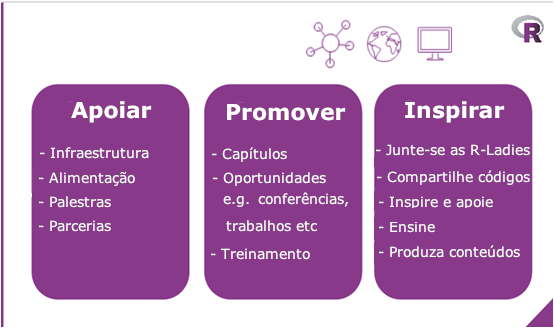
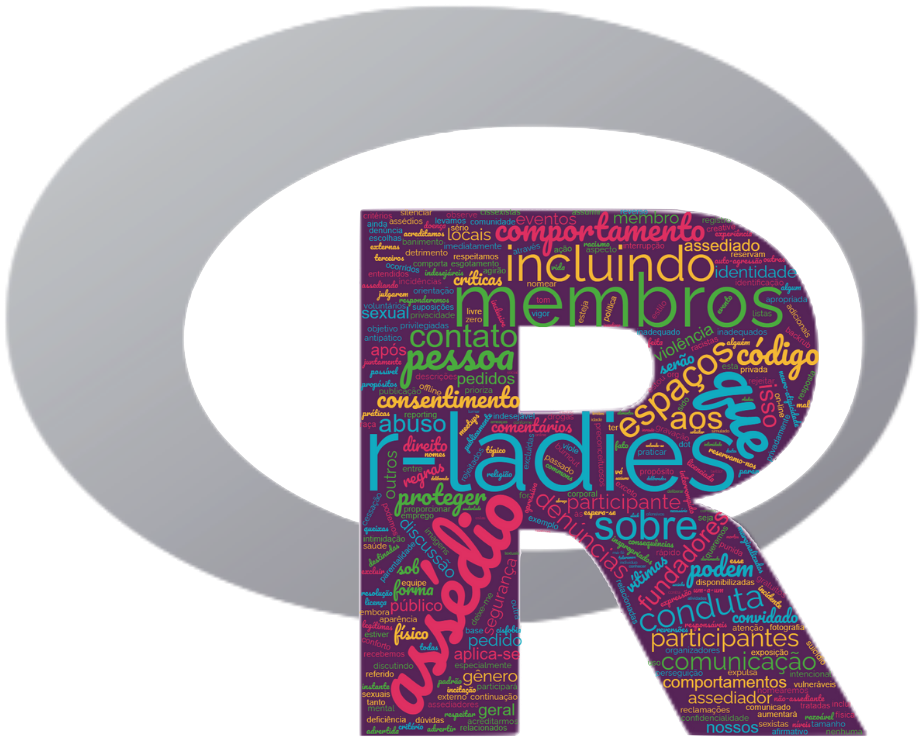

# [RLadies Ribeirão Preto](https://www.meetup.com/rladies-ribeirao-preto/) 

Somos um capítulo das [RLadies Global](https://rladies.org/), uma organização sem fins lucrativos que atua em diversos países. Nós nos encontramos [virtualmente] para aprender sobre a linguagem R.

## Quem somos?

 

## Missão

Promover o uso da linguagem R entre as minorias de genêro incluindo mulheres cis, mulheres trans, pessoas não-binárias, entre outros grupos subrepresentados para formarmos uma comunidade mais inclusiva e diversa. 

## Estrutura

## Como participar?

Confira como você pode participar das atividades das RLadies:

## Código de conduta

As RLadies tem como objetivo proporcionar uma experiência livre de assédio para todos. O nosso código de conduta aplica-se a todos os espaços RLadies, incluindo: meetups, Twitter, Slack, listas de discussão, tanto online como offline. Acesse o nosso código de conduta na página das [RLadies Global](https://guide.rladies.org/about/coc/#portuguese)

## Conheça as nossas redes sociais:

 [Meetup RLadies Ribeirão Preto](https://www.meetup.com/rladies-ribeirao-preto/) 

 [YouTube RLadies Ribeirão Preto](https://www.youtube.com/channel/UCmxRvwPXXLdcv_lWkIqB1yA/about)

 [@rladiesrp](https://github.com/rladiesrp)

 [@rladiesrp](https://www.facebook.com/rladiesrp)

 [@rladiesrp](https://www.instagram.com/rladiesrp/)

 [@rladiesrp](https://twitter.com/rladiesrp)

 [ribeirao-preto@rladies.org](mailto:ribeirao-preto@rladies.org)
